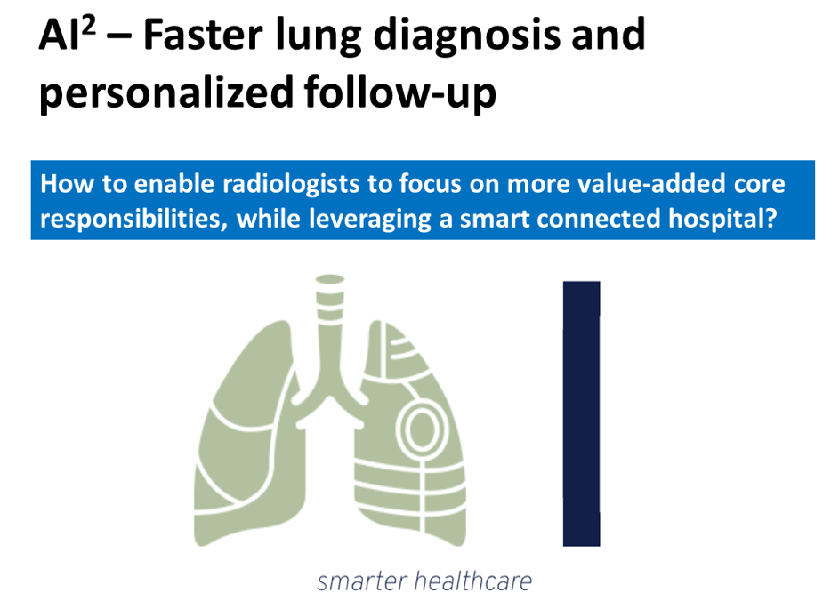
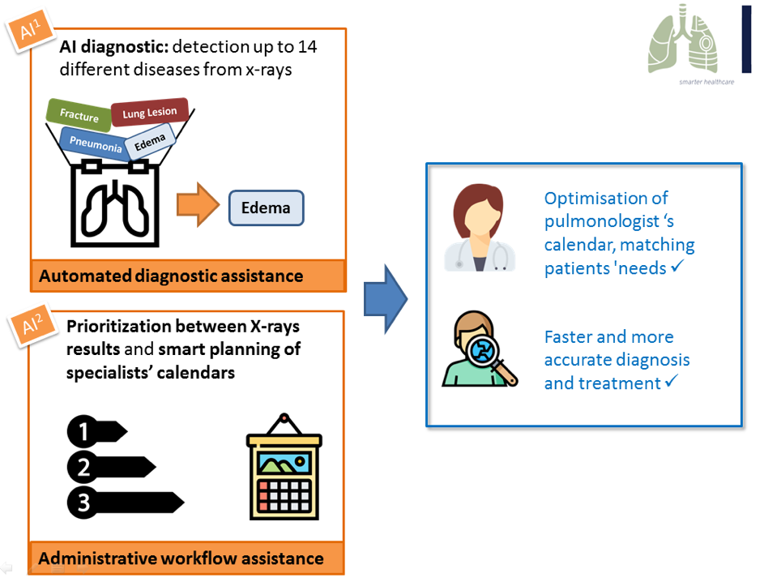

## Definition of the problem

**Technology to support specialists**: A 20-year literature review in 2001 suggested the level of error for clinically significant or major error in radiology to be in the range of 2-20% (depending on the radiological investigation) (1). In the field of pulmonology, “labelled datasets have driven deep learning methods to achieve expert-level performance on a variety of medical imaging 14 observations in radiology reports.” (2)

**Increasing administrative efficiency:** U.S. physicians spent around 1/6 of their time on administrative tasks(3). The higher efficiency provided by AI will allow radiologists to perform more value-added tasks, becoming more visible to patients and playing a vital role in multidisciplinary clinical teams.(4)

The beneficial impacts of AI solutions in the field of automated image diagnosis, prevention of preliminary diagnosis and administrative workflow assistance are estimated to 26 billion USD savings annually for the healthcare economy in the United States, by 2026.(5)

**Expanding customer experience in healthcare is now becoming one of the industry focus**: among top five top trends for healthcare customer experience (6):

* Patient Personalization
* Hospitals Using Smart Technology

Our AI solution leverage two AI technology streams to enables a faster lung diagnosis and personalized follow-up, enabling radiologists to focus on more value-added core responsibilities, while leveraging a smart connected hospital.

## Our approach

Our approach is to transform  prediction output from lung radio images, into an appointment with a lung specialist.

After disease detection and validation by a radiologist, a patient is given a priority score depending on the severity of his disease, as well as a recommended deadline to seek treatment (here, the deadline and severity score are parameters provided by medical professionals and are not deduced from machine learning).

After receiving his or her score, the result is sent to the content management system of the nearest hospital of the patient. And according to the priority assigned to his/her case, he/she gets an appointment made with a doctor.

The advantage of this approach is that it prioritizes the most urgent cases and helps doctors manage their schedule efficiently.

## How our AI solution positively impacts the patient journey

#### `Typical situation`

#### `With our solution: patient C gets an earlier appointment`

## Annexes

(1)	Goddard P, Leslie A, Jones A, Wakeley C, Kabala J. Error in radiology. Br J Radiol. 2001;74(886):949–51

(2) https://arxiv.org/pdf/1901.07031.pdf

(3)	https://www.ncbi.nlm.nih.gov/pubmed/25626223 

(4)	Pesapane F, Codari M, Sardanelli F. Artificial intelligence in medical imaging: threat or opportunity? Radiologists again at the forefront of innovation in medicine. Eur Radiol Exp. 2018;2(1):35. Published 2018 Oct 24. doi:10.1186/s41747-018-0061-6

(5)	https://medium.com/@Unfoldlabs/the-impact-of-artificial-intelligence-in-healthcare-4bc657f129f5 

(6)	https://www.forbes.com/sites/blakemorgan/2018/01/09/the-top-5-trends-in-customer-experience-for-healthcare/#19398d5923e6
